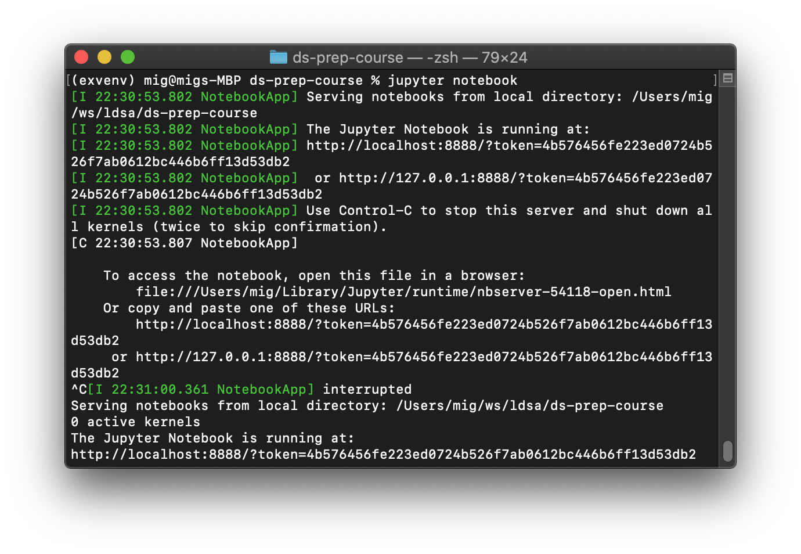
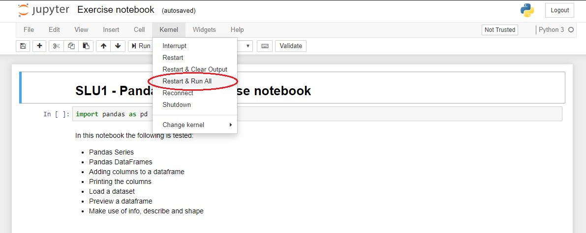

# Weekly workflow

**Each week** on Monday a new folder will be released on the [`ds-prep-course-2023`](https://github.com/LDSSA/ds-prep-course-2023) repository. On week 1 (April 3 - April 9), the folder released will be `Week 01`. On week 02, it will be called `Week 02`, and so on. These folders contain the learning units you'll be working on. The releases will be announced on Slack, on the **#announcements** channel. Follow this guide to get and work on the learning materials.

### 1.1 Get the learning materials

This section only needs to be done **ONCE for each week**. It is about getting the materials and copying them to your local workspace.

**Step 1:** Open a terminal and change to the local `ds-prep-course-2023` repo:

```bash
cd ~/projects/ds-prep-course-2023/
```

**Step 2:** Pull new material from the remote repo:
```bash
git pull
```

**Step 3:** Copy the new material to your workspace folder.

**⚠️ Before running the command below:** - If the `"Week <week number>"` folder already exists in your workspace folder, it will be replaced, so make sure you do this **once** and before starting to work on the exercises. Also, make sure that you copy just the new week's folder so that you don't overwrite your previous work.

```bash
cp -r ~/projects/ds-prep-course-2023/"Week <week number>" ~/projects/ds-prep-workspace/
```
Note that we are using quotes in the path because it contains spaces. Example for `Week 01`:

```bash
cp -r ~/projects/ds-prep-course-2023/"Week 01" ~/projects/ds-prep-workspace/
```

If you're curious about how you can do this using your OS GUI [check this guide](guides/using_os_gui_to_manage_directories.md)

### 1.2. Activate the `prep-venv` environment you created in the initial setup

```bash
source ~/.virtualenvs/prep-venv/bin/activate
```

### 1.3 Work on the learning units

All learning units come as a set of **Jupyter Notebooks**. These are documents that can contain text, images and live code that you can run interactively. You will learn how to use the Jupyter Notebooks in Week 00.

Navigate to your workspace folder:

```bash
cd ~/projects/ds-prep-workspace
```

Then follow the steps below.

**Step 1:** Open the Jupyter Notebook application by running:

```bash
jupyter-notebook --NotebookApp.use_redirect_file=False
```

You should see something similar to this happening in your terminal:

and your browser should pop up with Jupyter open. However, if this does not happen, you can simply copy the link you see on your terminal (the one that starts with `http://localhost`) and paste it in your browser's address bar.

**Note:** If you see some  scary looking messages, don't worry, you can just ignore them.

**Step 2:** Work on the learning unit (SLU).

⚠️ **Important:** **ALWAYS** work on the files in your `ds-prep-workspace` repository. **NEVER** work on the files inside in the `ds-prep-course-2023` repository!

- Study the **Learning Notebook**. You can interact with the notebook and try out the code.

- Complete the tasks in the **Exercise Notebook**. Don't forget to save your work as you go along!

<a name="link-to-grading"></a>
**Step 3:** Grading the exercise notebook

- Once you've solved all the exercises, we recommend following this simple checklist to avoid unexpected surprises:
   1. Save the Exercise notebook (again)
   2. Run "Restart & Run All"

   
   
   3. Ensure that the last cell of the notebook has been executed as represented by a number between brackets beside the top left of the cell. If instead of a number you see a '\*', the cell is still busy and the exercise notebook is not ready for submission.
   
   

   4. At this point the notebook should have run without any error messages showing up.

   

   5. Close all the notebooks, return to the terminal and stop the notebook server by typing `Ctrl+C+C` (`Ctrl` and `C` two times).
   
   6. [Get your Slack ID](https://moshfeu.medium.com/how-to-find-my-member-id-in-slack-workspace-d4bba942e38c) and submit the notebook to the [portal](https://prep-course-portal.ldsacademy.org/). The virtual environment has to be activated and you have be in the learning unit folder!

   ```bash
   cd ~/projects/ds-prep-workspace/"Week <week number>"/"<SLU name>"
   python submit.py --slackid "YOUR_SLACK_ID"
   ```

   **Example:** For Week 00 you'd do:

   ```bash
   cd ~/projects/ds-prep-workspace/"Week 00"/"SLU00 - Jupyter Notebook"
   python submit.py --slackid "YOUR_SLACK_ID"
   ```
 
   It can take a while for the submission to get through. If it worked out, you should get a message like this one. You will see your grade (score) and the learning unit number.

   ```bash
   20.0
   {'learning_unit': 0, 'exercise_notebook': 1, 'slackid': 'U04ST63FC02', 'score': 20.0}
   Success!
    {"id":10,"created":"2023-03-26T00:40:17.603128Z", "slackid":"U04ST63FC02", "learning_unit" 0, "exercise_notebook":1, "score":20.0}
   ```
   Your submission should now be on the [portal](https://prep-course-portal.ldsacademy.org/). The submissions are ordered by the learning unit number, then chronologically. The easiest way to find your submission is to search for your Slack ID.

**Step 4:** Commit and push

Now is the time to transfer your work from the local workspace repo to the remote workspace repo on `GitHub`. 

   1. Open a terminal and navigate to your local workspace:

   ```bash
   cd ~/projects/ds-prep-workspace
   ```

   2. These steps will take a snapshot of your local workspace in this moment in time and transfer it to your remote workspace repo. You will understand them once your have studied SLU03.

   ```bash
   git add .
   ```

   ```bash
   git commit -m "Exercises for Week <week number>"
   ```

   ```bash
   git push
   ```

   You'll be asked for your git username and password  - enter your `token` for the password.

## 1.4. Updates of the learning units

As much as we try and have processes in place to prevent errors and bugs in the learning units, some make it through to you. 

If the problem is not in the exercise notebook you can just pull the new version from the `ds-prep-course-2023` repo and replace the file in your `ds-prep-workspace` (steps 1 and 2 from [section 1.1](#11-get-the-learning-materials)). Make sure to replace just the new file and not overwrite any work you already did in the exercise notebook.

If the correction is in the exercise notebook, however, you can't just replace the file because your work is there and you'll lose it!

When a new version of the exercise notebook is released (and announced) you will have to copy the work you already did to the new version of the notebook:

1. Rename the old exercise notebook;
1. Copy the new exercise notebook over;
1. Open both exercise notebooks and copy paste your solutions to the new notebook.

We understand that it's not ideal and we are working on improving this workflow.
