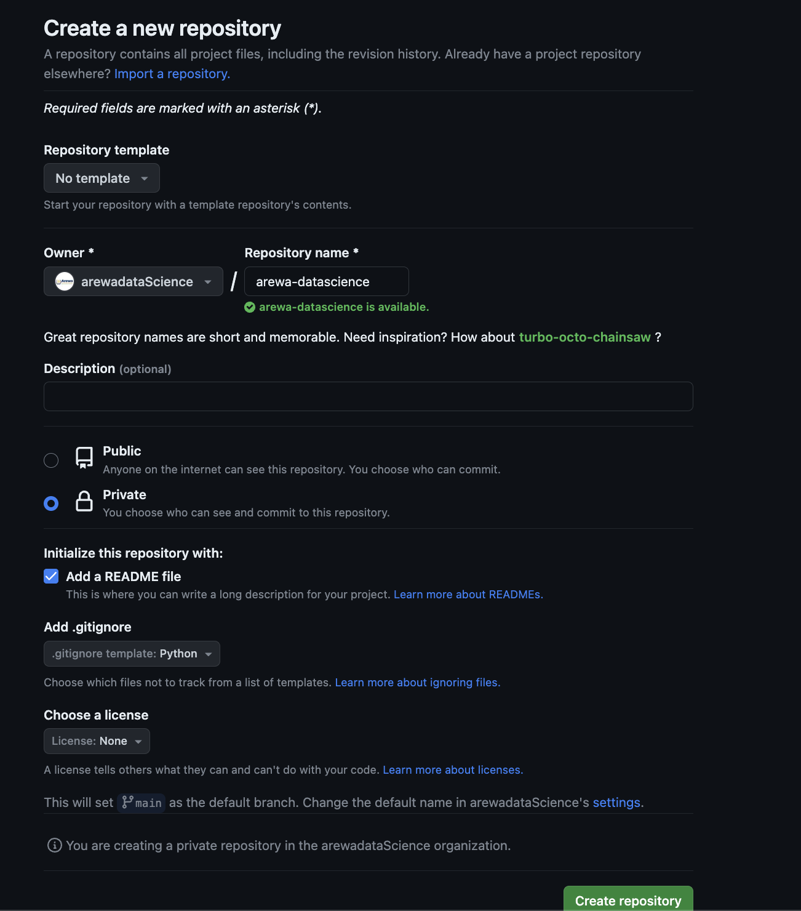

# 2. Setup _Git_ and _GitHub_

This guide will walk you through the process of setting up Git and GitHub. These tools are essential for managing and tracking changes in your projects and code. Don't worry if you're new to these concepts; we'll guide you step by step. This setup is crucial for your journey in the fellowship, as it lays the foundation for efficient and collaborative work in data science projects. By the end of this session, you will have:

- A GitHub account set up for hosting and sharing your code.
- A private workspace repository for your personal work and exercises.
- The Arewa Data Science Fellowship repository cloned, providing access to all learning materials.
- Basic knowledge and setup of Git for version control, enabling you to track and manage changes in your projects effectively.


## 1. Understanding Git and GitHub

- **Git**: `Git` is a distributed version-control system for tracking changes in source code. 
- **GitHub**: An online platform that uses Git. It allows you to store your repositories online and collaborate with others. A `repository` is where code lives, and the code from the prep course will live at [`arewa-ds-fewllowship`](https://github.com/arewadataScience/ArewaDS-Machine-Learning) repository (basically where you are right now, reading this). All the learning materials and exercises will be released (made available) on this repository. You will learn more about `git` in the coming weeks.

## 2. Sign Up for GitHub

### Step 1: Create a GitHub Account

1. Go to [GitHub's signup page](https://github.com/join).
2. Follow the instructions to create your account.

### Step 2: Configure Git

After signing up for GitHub, you'll need to configure Git on your computer:

1. Open your terminal (Command Prompt or PowerShell on Windows, Terminal on macOS and Linux).
2. Run the following commands to configure Git (replace the email and username with your own):

    ```bash
    git config --global user.email "your_email@example.com"
    git config --global user.name "YourUsername"
    ```
For example: **replace** `mig.dias.1212@gmail.com` below with the same email you used for github and `buedaswag` with your GitHub username

```bash
git config --global user.email "mig.dias.1212@gmail.com"
git config --global user.username "buedaswag"
```

## 3. Setup Your Workspace Repository

The workspace directory/repository is where you will place everything you are working on, solve exercises, make changes to files, etc.

### Step 1: Log Into GitHub

- Go to [GitHub](https://github.com) and log in with your credentials.

### Step 2: Create a New Repository


1. Click the "+" button in the upper-right corner of GitHub and select `New repository`.
2. Create a repository named `arewa-ds-workspace`.
   - Choose `Private` - this is your private work environment where nobody else will have access but you.
   - Initialize it with a `README`.
   - Select a Python `.gitignore` file. This file does exactly what it sounds like - it tells `git` which files to ignore when transfering files between your computer and `GitHub`.




You can also check [Creating a new repository](https://help.github.com/en/articles/creating-a-new-repository) on GitHub for help.
 
### Step 3: Clone Your Repository

- Your workspace repository now exists on `GitHub`, but you also need a local copy (clone) on your computer. 

- To work on your projects locally, you need to clone your repository.

- You will be working in the local repository and then transfer your work to your remote workspace repository on `GitHub`.

**Step 1:** Open a terminal (or use one you've already opened).

**Step 2:** Create a folder named `projects` by using the `mkdir` command. `mkdir` essentially stands for **m**a**k**e **dir**ectory. The tilde symbol `~` is a shortcut address for your home directory.

```bash
mkdir ~/projects
```

**Step 3:** Enter the folder by using the `cd` command. Did you know that `cd` means **c**hange **d**irectory? So basically changing to a different folder.

```bash
cd ~/projects
```

**Step 4:** You can now **clone** (create a local copy of) the `arewa-ds-workspace` repository you created on `GitHub`.
Replace `<username>` below with your `GitHub` username, removing the brackets `< >`, and run the command:

```bash
git clone https://github.com/<username>/arewa-ds-workspace.git
```

   **Note**: if you have had a `GitHub` account since before this course and you are using `ssh keys` instead of `tokens`, first make sure that you have completed the steps starting [here](https://docs.github.com/en/authentication/connecting-to-github-with-ssh/checking-for-existing-ssh-keys), then clone your repository like this. You can skip step 5 and continue with section 2.4.

   ```bash
   git clone git@github.com:<username>/arewa-ds-workspace.git
   ```

**Step 5:** You'll be asked for your `GitHub` username. Type it and press <kbd>enter</kbd>. Then you'll be asked for your git password. Passwords no longer work for `GitHub`, you will need to use `tokens`.

Go to <https://github.com/settings/tokens> and click on `Generate new token`. You can give it a name in the note field, such as `ldsa-token`. Then select `repo` in the scopes and click on `Generate token`. You will be shown a `token` you should save - **you will not be able to see it again after leaving that window**. 

Now use the `token` instead of your password and press <kbd>enter</kbd>

You should now have a local copy of your `arewa-ds-workspace` in your `~/projects/arewa-ds-workspace` folder.


### 2.4 Clone the `ArewaDS-Machine-Learning` repository

Let's clone the [`ArewaDS-Machine-Learning`](https://github.com/arewadataScience/ArewaDS-Machine-Learning) repository. This is where all of the learning materials will be made available as the course progresses. You will be getting them (pulling) from there.

**Step 1:** Open a terminal (or use one you've already opened) and enter the `projects` folder:

```bash
cd ~/projects
```

**Step 2:** Clone the ArewaDS-Machine-Learning course repository (the repository you're reading right now!):

```bash
git clone https://github.com/arewadataScience/ArewaDS-Machine-Learning.git
```

If you are using `ssh keys` for `GitHub`, use this command:

```bash
git clone git@github.com:arewadataScience/ArewaDS-Machine-Learning.git
```

And you're done with setting `Git` and `GitHub`! Go back to the main menu and continue with step.
