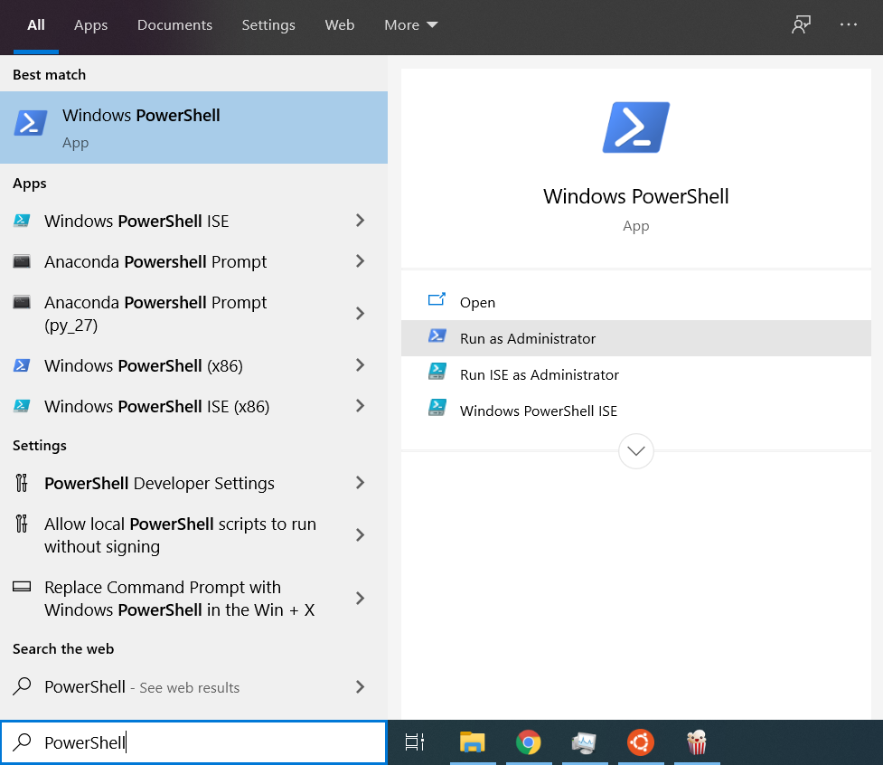
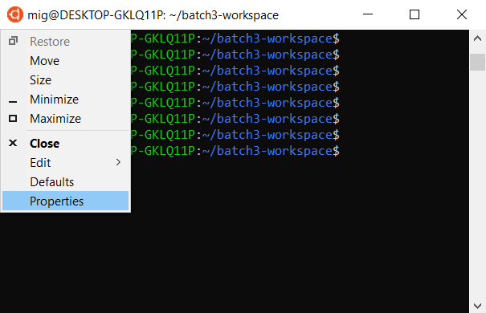

# Windows Subsystem for Linux Installation Guide for Windows 10

## Make sure that Windows is up to date

1. Type `update` in your Windows search bar:


then click `Check for Updates`:


then download and install any updates that appear in the Windows Update menu (shown below):


After you're done installing those updates, please [check which OS build of Windows 10 you are running](https://support.microsoft.com/en-us/help/13443/windows-which-version-am-i-running), and if your OS build number is smaller that `19041.XXX`, then please keep coming back to Windows Update and installing updates until you have at least OS build `19041.XXX`. Then you may proceed with this guide.


## Install the Windows Subsystem for Linux

Before installing any Linux distributions for WSL, you must ensure that the `Windows Subsystem for Linux` optional feature is enabled:

1. Open `PowerShell` as Administrator by typing `PowerShell` in your Windows search bar:


and then clicking `Run as Administrator`:



2. Then paste the following command in `PowerShell`:

```powershell
Enable-WindowsOptionalFeature -Online -FeatureName Microsoft-Windows-Subsystem-Linux
```


and run it by pressing <kbd>enter</kbd>:

3. Restart your computer if asked to.

## Install Ubuntu

1. Open this link to the [Microsoft Store](https://www.microsoft.com/store/apps/9N9TNGVNDL3Q) and select `Get` to install `Ubuntu`.

## Launch Ubuntu
To complete the initialization of your newly installed `Ubuntu`, launch a new instance. You can do this by typing `ubuntu` in your Windows search bar:


The first time the newly installed `Ubuntu` runs, a `Console` window will open, and you'll be asked to wait for a minute or two for the installation to complete.

> During this final stage of installation, `Ubuntu`'s files are de-compressed and stored on your PC, ready for use. This may take around a minute or more depending on the performance of your PC's storage devices. This initial installation phase is only required on the first launch - all future launches should take less than a second.

## Setting up a new Linux user account

Once the installation is complete, you will be prompted to create a new user account (and its password).


This user account is for the normal non-admin user that you'll be logged-in by default when launching `Ubuntu`.

> You can choose any username and password you wish - they have no bearing on your Windows username. Beware that when you type passwords in the terminal, you will not see what you are typing. This is a normal behaviour in Linux. Just type the password and hit <kbd>Enter</kbd>.

When you open a new `Ubuntu` instance, you won't be prompted for your password, but **if you elevate a process using `sudo`, you will need to enter your password**, so make sure you choose a password you can easily remember! On `Ubuntu`, every user can do admin tasks such as installing software, but they have to use the magic `sudo` word and input the password. This tells `Ubuntu` that you will be acting as admin in the next moments. 

## Opening the WSL terminal

>⚠️ **Important**: From now on, every time we ask you to open a terminal, this is what you need to do. We'll refer to it just as `terminal` instead of `WSL terminal` or `Ubuntu terminal`.

Whenever you want to use WSL, just type `ubuntu` in your Windows search bar.


Open it:


Then a `terminal` window will open that allows you to interact with `Ubuntu`.


## Enable copy and paste keyboard shortcuts

By default, the terminal does not allow the usual shortcuts for copying and pasting - you have to enable them first. In the upper left corner of the WSL terminal, click the orange circle:


then click `Properties`:



Then under the `Options` tab, in the `Edit Options` section, make sure that `Use Ctrl+Shift+C/V as Copy/Paste` in enabled and click `OK`:


## Update & upgrade Ubuntu's software packages

Most Linux distributions ship with an empty/minimal software package catalog. We strongly recommend regularly updating your package catalog, and upgrading your installed packages using the appropriate package manager. On `Ubuntu`, you use the `apt` package manager. The following command will check for software updates and install them:

```bash
sudo apt update && sudo apt upgrade
```

> Windows does not automatically update or upgrade your Linux distribution. This is a task that the Linux users prefer to control themselves.

## How to open Windows File Explorer to manipulate files inside WSL

If you’d like to use `Windows File Explorer` to manipulate the files in WSL, just type this in the `terminal`. **(Don't forget to include the dot! The dot means "current directory")**:

```console
explorer.exe .
```

The `Windows Explorer` should pop up:


Keep in mind that you should manipulate files and create directories inside your `Ubuntu-18.04/home/<your name>` folder.

You're all set with WSL! Now go back to the initial setup for Windows and continue with step 2.
