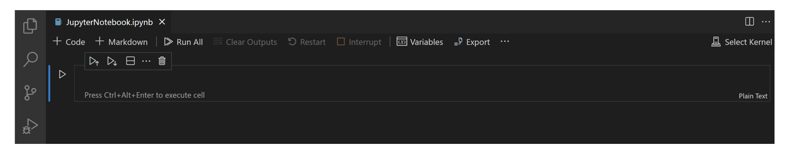
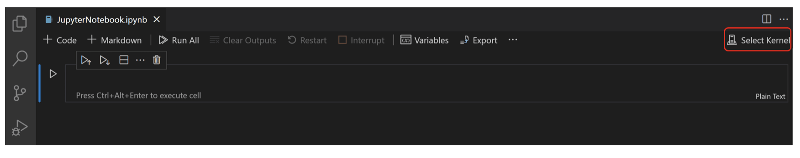

# Getting Started with VSCode for Data Science

Welcome to this beginner's guide on using Visual Studio Code (VSCode) for data science. This guide will walk you through setting up VSCode, using Jupyter notebooks, and getting started with a data science project.

## What is VScode ?

- VSCode (Visual Studio Code) is a lightweight but powerful source code editor developed by Microsoft for Windows, Linux and macOS.
- VSCode is a free and very popular code editor among developers. It is a very powerful tool for writing code in various programming languages.

<table>
  <tr>
    <td>
        
    </td>
  </tr>
</table>

- You can do all of your data science work within VS Code using Jupyter Notebook.

<table>
  <tr>
    <td>
        
    </td>
  </tr>
</table>

## Setting Up VSCode

### Step 1: Install Visual Studio Code

- Download and install VSCode from [here](https://code.visualstudio.com/).

## Extensions

The VS Code Marketplace offers a family of extensions that provide a first-class data science experience for Python data science. In order to enhance your data science workflow in VSCode, there are several extensions that can significantly boost productivity and ease of use. Below are some highly recommended extensions:

#### Python
- **Extension Name**: Python
- **Publisher**: Microsoft
- **Description**: Offers rich support for the Python language (including Python 3.8), with features such as IntelliSense, linting, debugging, code navigation, code formatting, Jupyter notebook support, refactoring, variable explorer, test explorer, and more.
- **Installation**: Search for `Python` in the Extensions view and install it.

#### Jupyter
- **Extension Name**: Jupyter
- **Publisher**: Microsoft
- **Description**: Enables you to work with Jupyter Notebooks directly within VSCode. Features include the ability to execute code cells, view, and modify notebooks, and much more.
- **Installation**: Search for `Jupyter` in the Extensions view and install it.

#### Pylance
- **Extension Name**: Pylance
- **Publisher**: Microsoft
- **Description**: Pylance is an extension that works alongside Python extension to provide fast and feature-rich language support for Python. It offers type information, auto-imports, type-checking, and much more.
- **Installation**: Search for `Pylance` in the Extensions view and install it.

#### Visual Studio IntelliCode
- **Extension Name**: Visual Studio IntelliCode
- **Publisher**: Microsoft
- **Description**: Provides AI-assisted IntelliSense by recommending commonly used completion items based on the current context in your code. This can be a big time-saver when coding in Python.
- **Installation**: Search for `Visual Studio IntelliCode` in the Extensions view and install it.

- **Installation**: Search for `Jupyter` in the Extensions view and install it.

#### GitLens — Git supercharged
- **Publisher**: Eric Amodio
- **Description**: Enhances the built-in Git capabilities of VSCode. It helps you visualize code authorship, navigate repositories, and understand code changes better.
- **Installation**: Search for `GitLens` in the Extensions view and install it.

#### Excel Viewer
- **Publisher**: GrapeCity
- **Description**: Allows you to open CSV and Excel files (.xlsx/.xls) directly in VSCode. It supports large files, formatting, and even editing cell values.
- **Installation**: Search for `Excel Viewer` in the Extensions view and install it.

#### Rainbow CSV
- **Publisher**: mechatroner
- **Description**: Highlights CSV and TSV files in different colors, making it easier to read and understand these data formats. It also provides functionality to align columns, which is particularly useful for large datasets.
- **Installation**: Search for `Rainbow CSV` in the Extensions view and install it.

#### GitHub Repositories
- **Publisher**: GitHub
- **Description**: Browse, search, and edit code from any GitHub repository directly within VSCode. Ideal for collaborative projects and managing code on GitHub.
- **Installation**: Search for `GitHub Repositories` in the Extensions view and install it.

#### GitHub Copilot
- **Publisher**: GitHub
- **Description**: An AI-powered code assistant that helps you write code faster and with fewer errors. Copilot can suggest whole lines or blocks of code as you type, learning from the context in your current file and related files.
- **Installation**: Search for `GitHub Copilot` in the Extensions view and install it.

### Step 2: Install Python and other  Extension

- Open VSCode.
- Navigate to the Extensions view by clicking on the Extensions icon in the Activity Bar on the side of the window.
- Search for `Python` and install the extension by Microsoft.
- Search for  `Jupyter`, `Pylance`, `IntelliCode Repositories`, `GitHub Copilot`, etc and install the extensions.

## Working with Jupyter Notebooks in VSCode

Jupyter (formerly IPython Notebook) is an open-source project that lets you easily combine Markdown text and executable Python source code on one canvas called a notebook. Visual Studio Code supports working with Jupyter Notebooks natively, and through Python code files. 

To work with Python in Jupyter Notebooks, you must activate a conda environment in VS Code, or another Python environment in which you've installed the Jupyter package. To select an environment, use the Python: Select Interpreter command from the Command Palette (⇧⌘P). Once the appropriate environment is activated, you can create and open a Jupyter Notebook, and export a Jupyter Notebook as a Python file.

### Step 3: Open or Create a Jupyter Notebook

- Open the Command Palette (`Ctrl+Shift+P`) and type `Jupyter: Create New Blank Jupyter Notebook`.
- Alternatively, you can open an existing `.ipynb` file by right-clicking on the file and opening with VS Code, or through the VS Code File Explorer.
- If you don't have Jupyter installed, you will be prompted to install it. Follow the instructions provided.

<table>
  <tr>
    <td>
        
    </td>
  </tr>
</table>

Next, select a kernel using the kernel picker in the top right.

<table>
  <tr>
    <td>
        
    </td>
  </tr>
</table>

After selecting a kernel, the language picker located in the bottom right of each code cell will automatically update to the language supported by the kernel.

<table>
  <tr>
    <td>
        
    </td>
  </tr>
</table>

### Step 5: Run Notebook Cells

- Write your Python code in a cell.
- Use `Shift+Enter` to run the cell and see the output below the cell.

## Starting a Data Science Project

### Step 6: Create a Project Folder

- Choose a location on your computer and create a new folder for your project.

### Step 7: Open the Folder in VSCode

- In VSCode, go to `File > Open Folder` and select your project folder.

### Step 8: Explore Data

- Create a new Jupyter notebook following the steps above and start exploring your data.

### Step 9: Save and Share Your Notebook

- Save your work by clicking on the save icon or using Ctrl+S.
- You can share your .ipynb notebook file with others, or upload it to a repository on GitHub.
Additional Resources

### Additional Resources

For more detailed information on data science with VSCode, visit the [official documentation](https://code.visualstudio.com/docs/datascience/overview).
Learn more about Jupyter notebooks in VSCode [here](https://code.visualstudio.com/docs/datascience/jupyter-notebooks).
Follow a comprehensive data science tutorial provided by VSCode [here](https://code.visualstudio.com/docs/datascience/data-science-tutorial).

