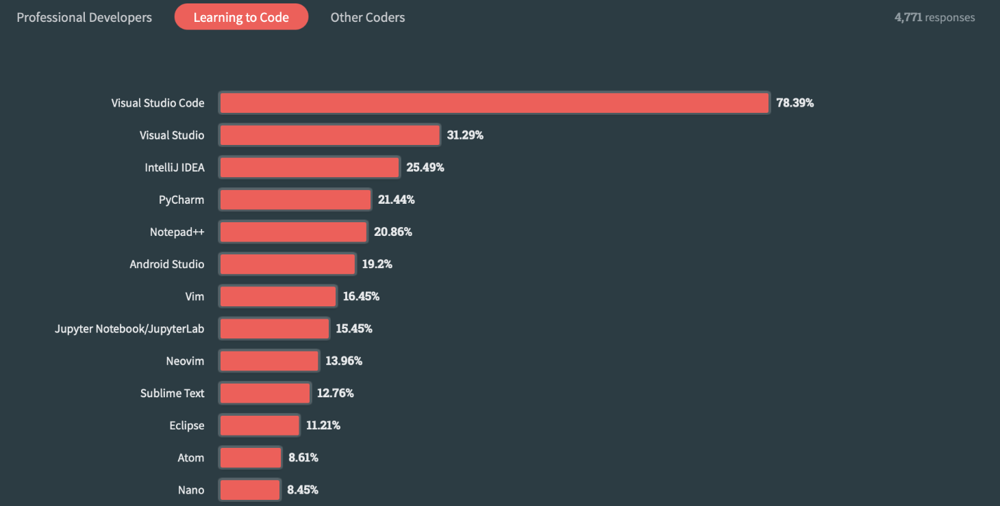

# Getting Started with VSCode for Data Science

Welcome to this beginner's guide on using Visual Studio Code (VSCode) for data science. This guide will walk you through setting up VSCode, using Jupyter notebooks, and getting started with a data science project.

## What is VScode ?

- VSCode (Visual Studio Code) is a lightweight but powerful source code editor developed by Microsoft for Windows, Linux and macOS.
- VSCode is a free and very popular code editor among developers. It is a very powerful tool for writing code in various programming languages.

<table>
  <tr>
    <td>
        
    </td>
  </tr>
</table>

- You can do all of your data science work within VS Code using Jupyter Notebook.

<table>
  <tr>
    <td>
        
    </td>
  </tr>
</table>

## Setting Up VSCode

### Step 1: Install Visual Studio Code

- Download and install VSCode from [here](https://code.visualstudio.com/).

### Step 2: Install Python Extension

- Open VSCode.
- Navigate to the Extensions view by clicking on the Extensions icon in the Activity Bar on the side of the window.
- Search for `Python` and install the extension by Microsoft.

## Working with Jupyter Notebooks in VSCode

### Step 3: Open or Create a Jupyter Notebook

- Open the Command Palette (`Ctrl+Shift+P`) and type `Jupyter: Create New Blank Jupyter Notebook`.
- Alternatively, you can open an existing `.ipynb` file.

### Step 4: Install Jupyter

- If you don't have Jupyter installed, you will be prompted to install it. Follow the instructions provided.

### Step 5: Run Notebook Cells

- Write your Python code in a cell.
- Use `Shift+Enter` to run the cell and see the output below the cell.

## Starting a Data Science Project

### Step 6: Create a Project Folder

- Choose a location on your computer and create a new folder for your project.

### Step 7: Open the Folder in VSCode

- In VSCode, go to `File > Open Folder` and select your project folder.

### Step 8: Explore Data

- Create a new Jupyter notebook following the steps above and start exploring your data.

### Step 9: Save and Share Your Notebook

- Save your work by clicking on the save icon or using Ctrl+S.
- You can share your .ipynb notebook file with others, or upload it to a repository on GitHub.
Additional Resources

### Additional Resources

For more detailed information on data science with VSCode, visit the [official documentation](https://code.visualstudio.com/docs/datascience/overview).
Learn more about Jupyter notebooks in VSCode [here](https://code.visualstudio.com/docs/datascience/jupyter-notebooks).
Follow a comprehensive data science tutorial provided by VSCode [here](https://code.visualstudio.com/docs/datascience/data-science-tutorial).

